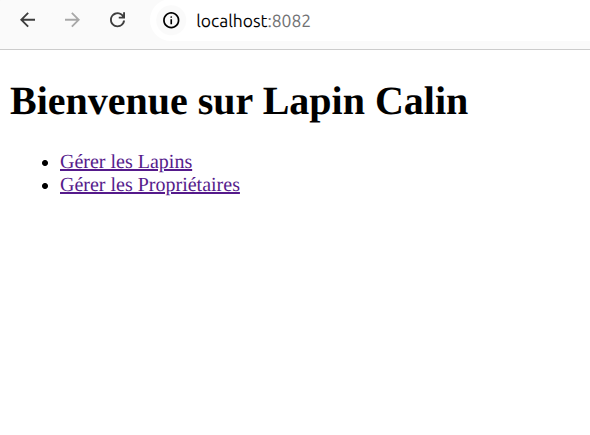
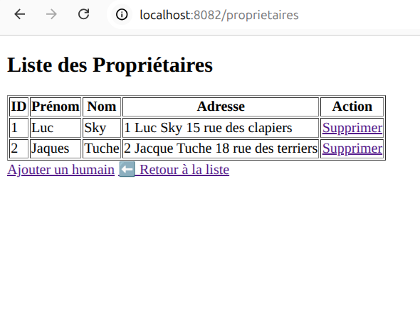
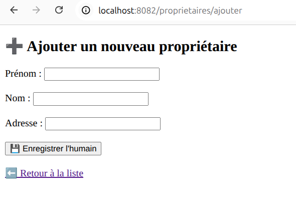
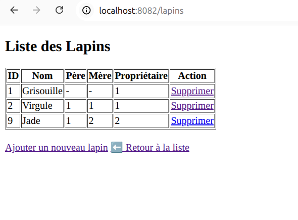
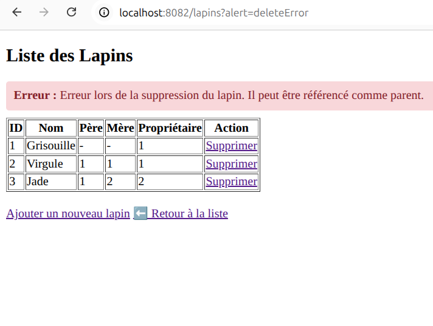
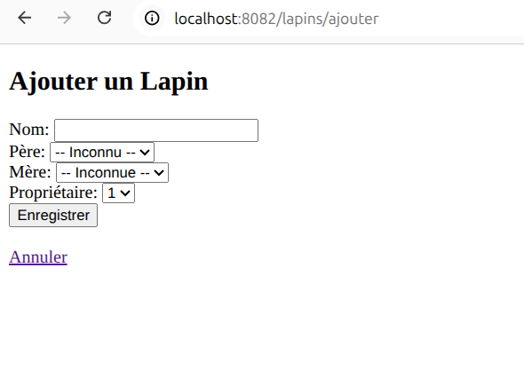

# RAPPORT DE PROJET : APPLICATION MULTI-TIERS « LAPIN CÂLIN »
**Cours :** Programmation d'applications multi-tiers  
**Enseignant :** Nicolas Marilleau  
**Étudiant :** KASDI Oumaima 

---

## 1. INTRODUCTION
Ce projet a pour objectif la conception et l'implémentation d'une application de gestion généalogique pour un élevage de lapins papillons. Au-delà de l'aspect fonctionnel, ce travail vise à mettre en pratique les concepts fondamentaux de l'architecture multi-tiers, la gestion de la persistance des données et l'inversion de contrôle via le framework Spring Boot.

---

## 2. ARCHITECTURE LOGICIELLE
L'application repose sur une **architecture 3-tiers** classique, garantissant une séparation stricte des préoccupations (*Separation of Concerns*) :

1.  **La Couche Présentation (IHM) :** Réalisée avec le moteur de template **Thymeleaf**, elle interagit avec l'utilisateur via des formulaires et des tableaux dynamiques.
2.  **La Couche Métier (Service) :** C'est le cœur de l'application. Pour assurer un **couplage faible**, chaque service est défini par une **interface** (`ILapinService`, `IProprietaireService`) et une classe d'implémentation. Cela permet de modifier la logique sans impacter les autres couches.
3.  **La Couche de Données (Persistance) :** Utilise **Spring Data JPA** et le moteur **Hibernate**. Elle transforme nos objets Java en tables SQL de manière transparente.

## 3. MODÉLISATION ET PERSISTANCE
La base de données se compose de deux entités liées :

*   **Entité `Proprietaire` :** Représente les utilisateurs de l'élevage. Chaque propriétaire possède un identifiant unique (`IDUser`), un nom, un prénom et une adresse.
*   **Entité `Lapin` :** C'est l'entité centrale. Elle implémente une **auto-référence** pour modéliser les liens généalogiques (`papa` et `maman` pointent vers d'autres instances de `Lapin`). Elle est liée au propriétaire par une relation **`@ManyToOne`** (plusieurs lapins pour un seul propriétaire).

Le choix de l'identifiant `Long` et de la stratégie de génération automatique (`GenerationType.AUTO`) assure une gestion robuste des clés primaires.

## 4. DÉTAILS DE L’IMPLÉMENTATION

### A. Inversion de Contrôle (IoC)
Toute l'application repose sur le principe d'Inversion de Contrôle. Au lieu d'instancier manuellement nos classes, nous utilisons l'annotation **`@Autowired`**. Spring injecte automatiquement les composants nécessaires (Repositories dans les Services, Services dans les Contrôleurs) lors de la phase de **consolidation des liens**.

### B. Gestion des Erreurs (Optional)
Dans la couche Service, la manipulation des données utilise les objets **`Optional`** avec la méthode `.orElse(null)`. Cette approche permet d'éviter les erreurs de type `NullPointerException` lors de la recherche d'un parent ou d'un propriétaire qui n'existerait pas encore en base de données.

### C. Flux de Données (Controller)
Les contrôleurs gèrent les requêtes HTTP :
*   **`@GetMapping`** : Utilisé pour l'affichage de la liste et du formulaire.
*   **`@PostMapping`** : Utilisé pour sécuriser l'envoi des données lors de l'enregistrement.
*   **`redirect`** : Après chaque action (ajout, suppression), une redirection est effectuée vers la liste principale pour garantir que l'utilisateur voit les données à jour et éviter les doublons lors d'un rafraîchissement de page.

## 5. DÉPLOIEMENT ET CONTENEURISATION
Pour garantir la portabilité et l'indépendance de l'environnement, le projet est déployé via **Docker Compose**. 
L'architecture est distribuée sur deux containers :
*   **Container `app` :** Contient l'application Spring Boot.
*   **Container `db` :** Contient le serveur MySQL 8.0.

L'interopérabilité entre les deux est assurée par la configuration du `datasource` dans le fichier `application.properties`, pointant vers le nom du service Docker au lieu de `localhost`.

## 6. RÉSULTATS (DÉMONSTRATION)
On a tout d'abord la page d'accueil poour choisir l'accès a la dage de gestion des lapins ou des propriétaires :
 

### 6.1 Liste des Propriétaires (Question 2)
 On observe ici la persistance des données injectées au démarrage ou via le formulaire:
 
 

### 6.2 Généalogie des Lapins (Question 4 & 5)
Le tableau affiche les liens de parenté et les propriétaires. Le bouton "Supprimer" permet de retirer un individu de la base de données ( s'il n'est pas référencé comme parent d'un autre lapin ): 
 
 

 Dans le tableau, Grisouille ne peut pas être son propre père ou sa propre mère au moment de sa création. Comme son identifiant (ID) est généré automatiquement par la base de données, il n'existe pas encore au moment où on essaie de faire le lien. 
Pour contourner ce problème, une solution serait de créer deux entités à part (par exemple 'LienPère' et 'LienMère'). Cela permettrait d'enregistrer tous les lapins d'abord, puis de créer les liens de parenté plus tard, une fois que tous les IDs sont connus."

### 6.3 Formulaire d'Ajout (Question 6)
 
 L'interface propose des listes déroulantes dynamiques récupérant les données des autres tables (Parents et Propriétaires).

## 7. CONCLUSION
Ce projet a permis de maîtriser le flux complet d'une application multi-tiers moderne. L'utilisation combinée de Spring Boot, JPA et Docker offre une solution scalable, facile à maintenir et prête pour un déploiement en production.

##  LIEN GITHUB
Vous pouvez consulter l'intégralité du code source à l'adresse suivante :  
`https://github.com/oumaimakasdi/projet_lapin_calin/tree/main`

